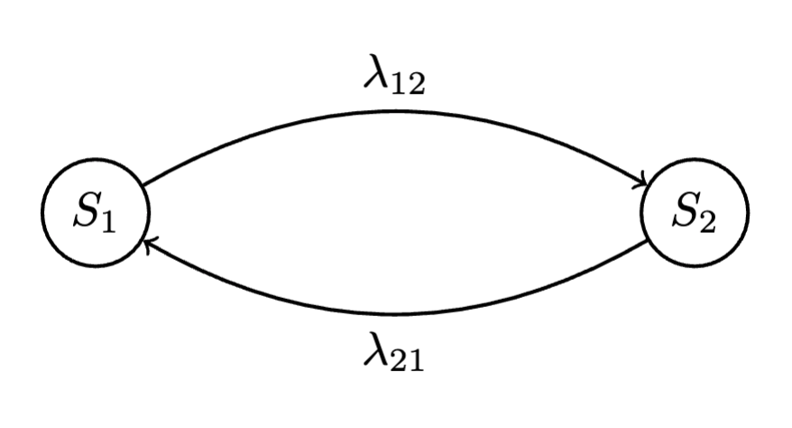
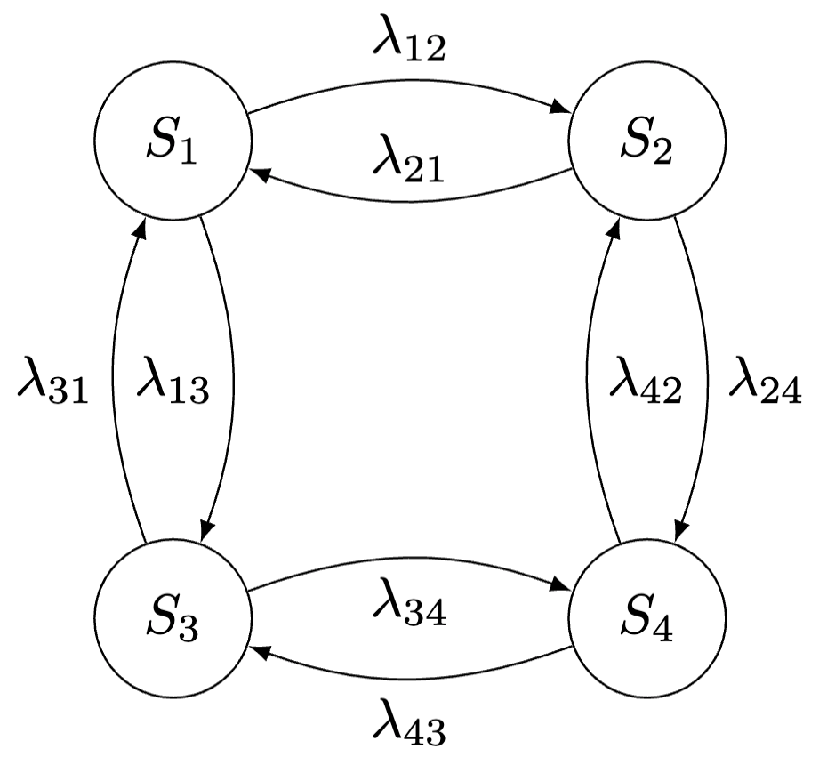
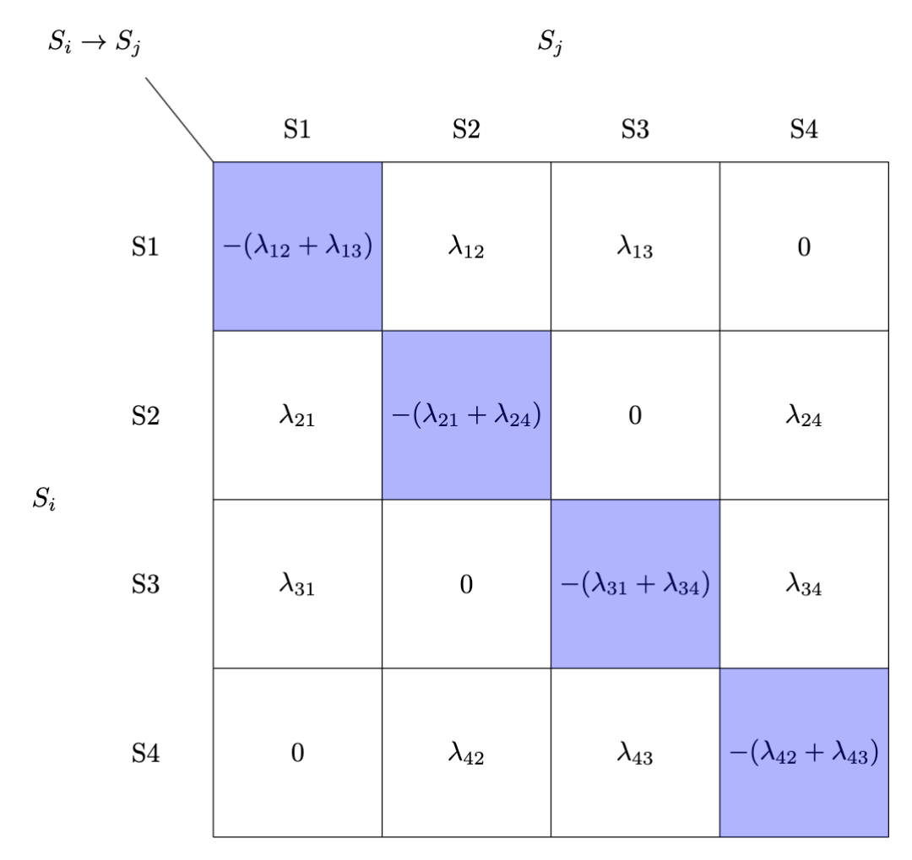

## Graf stanów opisany łańcuchem Markowa w czasie ciągłym (CTMC - Continuous Time Markov Chain)

Zaczynamy od prostego modelu dwustanowego. Stan może być **sprawny** (S1) lub **uszkodzony** (S2). Czas spędzony w danym stanie przed pójściem do następnego jest zależny od rozkładu wykładniczego.

$S1$ - Stan sprawny

$S2$ - Stan uszkodzony

$\lambda_{12}$ - **Parametr intensywności** przejście ze stanu $S1$ do stanu $S2$

$\lambda_{21}$ - **Parametr intensywności** przejście ze stanu $S2$ do stanu $S1$

### Parametr intensowyności 

$T_{i}$ -  średni czas bycia w stanie $i$

$$\lambda_{ij} = \frac{1}{T_{i}}$$

### Macierz intensywności

Dla modelu możemy zdefiniować macierz przejść. 
$$Q = [q_{ij}]$$
$$q_{ij} = \begin{cases}
\lambda_{ij} & \text{dla } i \neq j \\
-\sum_{k=1, k \neq i}^{n} \lambda_{ik} & \text{dla } i = j
\end{cases}$$

Możemy zauważyć, że suma każdego wiersza jest równa $0$.